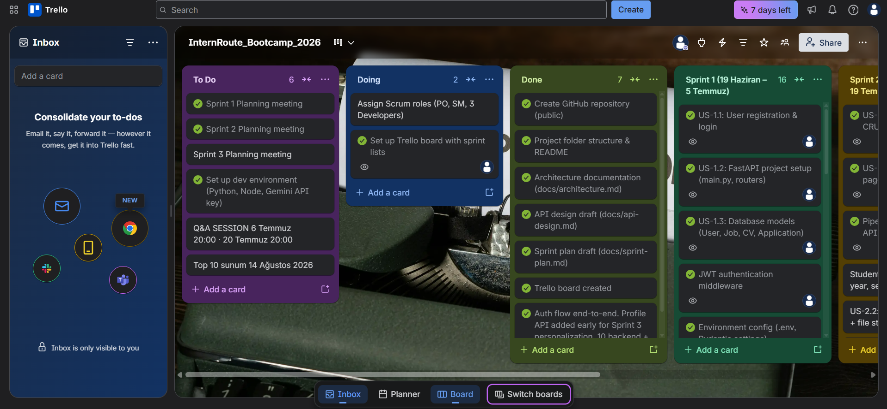
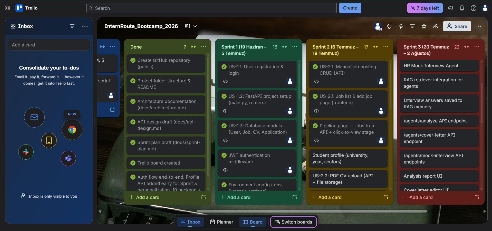
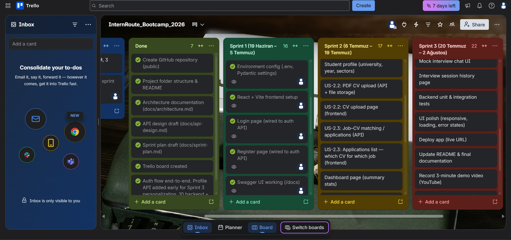
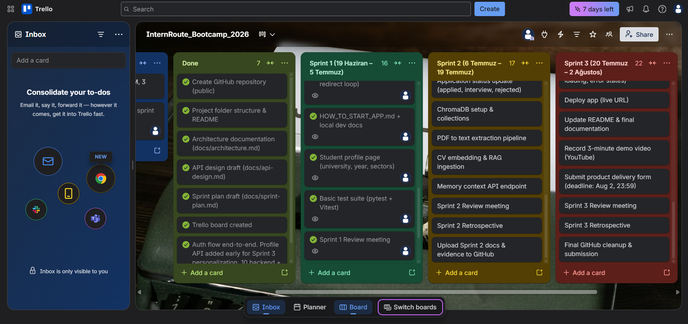

<p align="center">
  
</p>

<p align="center"><strong>Your AI-powered personal career &amp; internship command center</strong></p>

📋 **Scrum Board:** [InternRoute Bootcamp 2026 on Trello](https://trello.com/b/yTUmFEoB/internroutebootcamp2026)

[](LICENSE)
[](https://www.python.org/)
[](https://fastapi.tiangolo.com/)
[](https://react.dev/)

> Built with Scrum during **YZTA Bootcamp 2026** — 3 sprints × 2 weeks

---

## Team Name

**InternRoute Team** — YZTA Bootcamp 2026

---

## Team Members & Roles

| Name | Role |
|------|------|
| **Gülce Çelik** | Scrum Master & Developer |
| **Muhammed Enes Andiç** | Product Owner & Developer |

> **Note on team size:** We are officially a **5-person bootcamp team**, but we have been unable to reach our other teammates. For now, **Gülce and Muhammed are carrying the project forward** — roles above reflect who is actively contributing; the full five-person role split may be updated if others rejoin.

---

## Product Name

**InternRoute**

---

## Product Description

**InternRoute** is not a job search engine or web scraper. It is a **personal career operating system** for students and early-career applicants who find internships and jobs on LinkedIn, Kariyer.net, company sites, or referrals — and need one place to **organize**, **track**, and **prepare**.

Users manually add the roles they care about, upload **role-specific CV versions**, and track each application through stages (saved → applied → interview → offer). Over time, the platform builds a **memory layer (RAG)** from CVs and interview answers, then uses **multi-agent AI** to:

- Analyze gaps between a CV and a job listing  
- Draft tailored cover letters  
- Run mock HR interviews for a specific role  

The goal is simple: **stop losing applications in random notes** and walk into every interview prepared.

### How it works

```
┌─────────────┐     ┌──────────────┐     ┌─────────────────┐
│  Job + CV   │────▶│  Dashboard   │────▶│  Memory (RAG)   │
│  Upload     │     │  & Pipeline  │     │  Vector DB      │
└─────────────┘     └──────────────┘     └────────┬────────┘
                                                  │
                    ┌─────────────────────────────┼─────────────────────────────┐
                    ▼                             ▼                             ▼
            ┌───────────────┐           ┌─────────────────┐           ┌─────────────────┐
            │ Analyzer      │──────────▶│ Writer Agent    │           │ HR Mock Agent   │
            │ Gap analysis  │           │ Cover letter    │           │ Mock interview  │
            └───────────────┘           └─────────────────┘           └─────────────────┘
```

---

## Product Features

### Live today (Sprint 1 + early Sprint 2)

| Feature | Description |
|---------|-------------|
| **Auth** | Register, login, JWT sessions, protected routes |
| **Student profile** | University, year, major, target sectors — feeds future AI personalization |
| **Job board** | Pin roles manually (title, company, location, description, status) |
| **Application pipeline** | Visual flow per role: Saved → Applied → Interview → Offer |
| **Dashboard** | Live stats (pinned applications); placeholders for CV & AI counts |
| **Status tracking** | Applied, interview, rejected, offer badges on each role |
| **API docs** | Interactive Swagger UI at `/docs` |
| **Tests** | Backend pytest (10) + frontend Vitest (5) |

### Coming in Sprint 2 (Jul 6 – 19)

| Feature | Description |
|---------|-------------|
| **CV locker** | PDF upload, multiple versions per role, file storage |
| **Job–CV matching** | Applications API — which CV was used for which job |
| **RAG foundation** | ChromaDB, PDF → text, embeddings, memory context API |
| **Full dashboard stats** | Real CV and application counts |

### Coming in Sprint 3 (Jul 20 – Aug 2)

| Feature | Description |
|---------|-------------|
| **Analyzer Agent** | CV vs job gap scan with RAG-backed insights |
| **Writer Agent** | Company-aware cover letter drafts |
| **HR Mock Agent** | Role-specific mock interview chat; answers saved to memory |
| **Deploy & demo** | Live URL, polished UI, 3-minute demo video, final delivery |

---

## Target Audience

- **University students** applying for internships and new-grad roles  
- **Early-career applicants** juggling multiple tailored CVs and deadlines  
- **Bootcamp / self-learners** who want structured application tracking without a generic spreadsheet  
- **Age range:** roughly **18–28** — anyone actively building their first professional pipeline  

---

## Product Backlog

📋 **[InternRoute Bootcamp 2026 — Trello Board](https://trello.com/b/yTUmFEoB/internroutebootcamp2026)**

Stories are prioritized by sprint. Tasks (red labels) break down user stories (blue labels). No single story exceeds half of a sprint’s total story points.

### Sprint board (Sprint 1 close-out)

<p align="center">
  
</p>

<p align="center">
  
</p>

<p align="center">
  
</p>

<p align="center">
  
</p>

---

## Bootcamp Sprint Calendar

| Sprint | Dates | Focus |
|--------|-------|-------|
| **Sprint 1** | 19 Jun – 5 Jul 2026 | Auth, FastAPI core, React shell, basic UI |
| **Sprint 2** | 6 Jul – 19 Jul 2026 | Jobs, CV upload, applications, RAG pipeline |
| **Sprint 3 (Delivery)** | 20 Jul – 2 Aug 2026 | AI agents, polish, deploy, demo video |

**Final delivery:** 2 August 2026, 23:59 · **Top 10 presentations:** 14 August 2026

---

## Sprint 1 — Completed ✅

**Dates:** 19 June – 5 July 2026

### What we shipped

- FastAPI application with SQLite, modular routers, Pydantic settings  
- User registration & login with JWT (`/auth/register`, `/auth/login`, `/auth/me`)  
- Database models: `User`, `Job` (CV & Application models scaffolded for Sprint 2)  
- Student profile API (`GET/PATCH /api/v1/profile`)  
- Job postings CRUD API with auth-scoped access  
- React 19 + Vite + TypeScript frontend with warm “student career kit” UI  
- Pages: Login, Register, Dashboard, Job Board, Pipeline, Profile  
- Sprint 2/3 placeholder screens: CVs, Analyze, Mock Interview, Cover Letter  
- Swagger UI, `.env.example`, `HOW_TO_START_APP.md`  
- Automated tests: **pytest** (backend) + **Vitest** (frontend)  

### Tech used in Sprint 1

| Layer | Stack |
|-------|-------|
| **Backend** | Python 3.11+, FastAPI, SQLAlchemy, Pydantic v2, python-jose (JWT), bcrypt |
| **Database** | SQLite (`internroute.db`) |
| **Frontend** | React 19, Vite 7, TypeScript, React Router |
| **Testing** | pytest, Vitest, Testing Library, jsdom |
| **Tooling** | Git, Trello, local `.venv` + `npm` |

### Product screenshots (Sprint 1)

<p align="center">
  
  <br/><em>Sign in — split-panel auth with bootcamp branding</em>
</p>

<p align="center">
  
  <br/><em>Home — command desk with live application count and pipeline preview</em>
</p>

<p align="center">
  
  <br/><em>Board — pin roles from any source and set application status</em>
</p>

<p align="center">
  
  <br/><em>Pipeline — click a role to see its stage on the progress bar</em>
</p>

<p align="center">
  
  <br/><em>Profile — university, year, major and target sectors for AI personalization</em>
</p>

---

## Sprint 2 — Planned 🚧

**Dates:** 6 July – 19 July 2026

### Goals

Turn InternRoute from a tracking board into a **CV-aware application hub** with the RAG memory layer started.

### Backlog highlights

- **US-2.2** PDF CV upload (API + file storage) and CV locker UI  
- **US-2.3** Job–CV matching / applications API and frontend list  
- Application status workflow (applied, interview, rejected, offer) — *partially live on board*  
- Dashboard summary stats wired to real CV/application data  
- **ChromaDB** setup & collections  
- PDF → text extraction pipeline  
- CV embedding & RAG ingestion  
- Memory context API endpoint  
- Sprint 2 review, retro, GitHub evidence upload  

### UI preview (Sprint 2 screen — built as placeholder)

<p align="center">
  
  <br/><em>CV locker — multiple versions per role; upload ships in Sprint 2</em>
</p>

---

## Sprint 3 — Planned 🔮

**Dates:** 20 July – 2 August 2026 · **Delivery deadline: 2 Aug 23:59**

### Goals

Ship the **multi-agent AI layer**, connect it to RAG memory, deploy, and record the demo.

### Backlog highlights

- LangChain agent orchestration  
- **Analyzer Agent** — `/agents/analyze`, gap report UI  
- **Writer Agent** — `/agents/cover-letter`, editable letter studio  
- **HR Mock Agent** — `/agents/mock-interview`, session history  
- RAG retriever integration; interview answers saved to memory  
- UI polish (responsive, loading, error states)  
- Deploy to live URL · Update README · 3-minute YouTube demo  
- Submit product delivery form · Sprint 3 review & retro  

### UI previews (Sprint 3 screens — designed, not wired yet)

<p align="center">
  
  <br/><em>Analyze — CV vs role gap scan (Analyzer Agent, Sprint 3)</em>
</p>

<p align="center">
  
  <br/><em>Interview — HR Mock Agent chat (Sprint 3)</em>
</p>

<p align="center">
  
  <br/><em>Letters — Writer Agent cover letter studio (Sprint 3)</em>
</p>

---

## Technology Stack (Full Project)

| Layer | Technology |
|-------|------------|
| **Backend** | Python, FastAPI |
| **AI Orchestration** | LangChain *(Sprint 3)* |
| **Vector Database** | ChromaDB *(Sprint 2–3)* |
| **LLM API** | Google Gemini API |
| **Frontend** | React + Vite + TypeScript |
| **Validation** | Pydantic v2 |
| **Auth** | JWT (Bearer tokens) |

---

## Getting Started

See **[HOW_TO_START_APP.md](HOW_TO_START_APP.md)** for step-by-step local setup on Windows.

Quick start:

```bash
# Backend
cd backend
python -m venv .venv
.venv\Scripts\activate          # Windows
pip install -r requirements.txt
uvicorn app.main:app --reload --port 8000

# Frontend (new terminal)
cd frontend
npm install
npm run dev
```

Copy `.env.example` to `.env` and set `SECRET_KEY` + `GEMINI_API_KEY` when working on AI features.

Run tests:

```bash
python scripts/run-all-tests.py
```

---

## Project Structure

```
InternRoute/
├── backend/                 # FastAPI app (auth, jobs, profile, agents, RAG)
├── frontend/                # React (Vite) SPA
├── docs/                    # Architecture, API design, sprint plan, screenshots
│   └── images/              # README & sprint evidence (ui/, trello/)
├── scripts/                 # Test runners, git helpers
├── .cursor/                 # Project hooks & skills
├── HOW_TO_START_APP.md
├── .env.example
└── README.md
```

Further reading: [`docs/architecture.md`](docs/architecture.md) · [`docs/api-design.md`](docs/api-design.md) · [`docs/sprint-plan.md`](docs/sprint-plan.md)

---

## License

This project is licensed under the [MIT License](LICENSE).

---

## Contact

**Repository:** [github.com/gulce-celik/InternRoute](https://github.com/gulce-celik/InternRoute)

**Contributors:** [Gülce Çelik](https://github.com/gulce-celik) · Muhammed Enes Andiç
