<p align="center">
  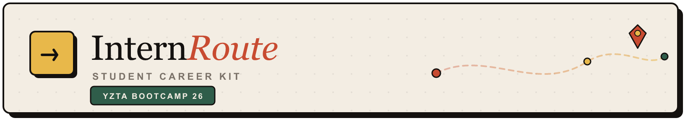
</p>

<p align="center"><strong>Your AI-powered personal career &amp; internship command center</strong></p>

📋 **Scrum Board:** [InternRoute Bootcamp 2026 on Trello](https://trello.com/b/yTUmFEoB/internroutebootcamp2026)

[](LICENSE)
[](https://www.python.org/)
[](https://fastapi.tiangolo.com/)
[](https://react.dev/)

> Built with Scrum during **YZTA Bootcamp 2026** — 3 sprints × 2 weeks

---

## Team Name

**InternRoute Team** — YZTA Bootcamp 2026

---

## Team Members & Roles

| Name | Role |
|------|------|
| **Gülce Çelik** | Scrum Master & Developer |
| **Muhammed Enes Andiç** | Product Owner & Developer |

> **Note on team size:** We are officially a **5-person bootcamp team**, but we have been unable to reach our other teammates. For now, **Gülce and Muhammed are carrying the project forward** — roles above reflect who is actively contributing; the full five-person role split may be updated if others rejoin.

---

## Product Name

**InternRoute**

---

## Product Description

**InternRoute** is not a job search engine or web scraper. It is a **personal career operating system** for students and early-career applicants who find internships and jobs on LinkedIn, Kariyer.net, company sites, or referrals — and need one place to **organize**, **track**, and **prepare**.

Users manually add the roles they care about, upload **role-specific CV versions**, and track each application through stages (saved → applied → interview → offer). Over time, the platform builds a **memory layer (RAG)** from CVs and interview answers, then uses **multi-agent AI** to:

- Analyze gaps between a CV and a job listing  
- Draft tailored cover letters  
- Run mock HR interviews for a specific role  

The goal is simple: **stop losing applications in random notes** and walk into every interview prepared.

### How it works

```
┌─────────────┐     ┌──────────────┐     ┌─────────────────┐
│  Job + CV   │────▶│  Dashboard   │────▶│  Memory (RAG)   │
│  Upload     │     │  & Pipeline  │     │  Vector DB      │
└─────────────┘     └──────────────┘     └────────┬────────┘
                                                  │
                    ┌─────────────────────────────┼─────────────────────────────┐
                    ▼                             ▼                             ▼
            ┌───────────────┐           ┌─────────────────┐           ┌─────────────────┐
            │ Analyzer      │──────────▶│ Writer Agent    │           │ HR Mock Agent   │
            │ Gap analysis  │           │ Cover letter    │           │ Mock interview  │
            └───────────────┘           └─────────────────┘           └─────────────────┘
```

---

## Product Features

### Delivered in Sprint 1

| Feature | Description |
|---------|-------------|
| **Auth** | Register, login, JWT sessions, protected routes |
| **Student profile** | University, year, major, target sectors — foundation for Sprint 3 AI personalization |
| **React app shell** | Login, Register, layout, navigation, Sprint 2/3 placeholder screens |
| **API docs** | Interactive Swagger UI at `/docs` |
| **Tests** | Backend pytest (10) + frontend Vitest (5) |
| **Database scaffold** | User model live; Job, CV, Application models prepared for Sprint 2 |

### Delivered in Sprint 2 (Jul 6 – 19)

| Feature | Description |
|---------|-------------|
| **Job board** | Manual job posting CRUD, pin roles, application status |
| **Application pipeline** | Job–CV matching, status flow, notes + written screening Q&A |
| **Dashboard** | Live summary stats for applications, CV versions, offers |
| **CV locker** | PDF upload, view, delete; CV can be reassigned on applications |
| **RAG foundation** | ChromaDB, PDF → text → chunks → embeddings, memory context API |

### Coming in Sprint 3 (Jul 20 – Aug 2)

| Feature | Description |
|---------|-------------|
| **Analyzer Agent** | CV vs job gap scan with RAG-backed insights |
| **Writer Agent** | Company-aware cover letter drafts |
| **HR Mock Agent** | Role-specific mock interview chat; answers saved to memory |
| **Deploy & demo** | Live URL, polished UI, 3-minute demo video, final delivery |

---

## Target Audience

- **University students** applying for internships and new-grad roles  
- **Early-career applicants** juggling multiple tailored CVs and deadlines  
- **Bootcamp / self-learners** who want structured application tracking without a generic spreadsheet  
- **Age range:** roughly **18–28** — anyone actively building their first professional pipeline  

---

## Product Backlog

📋 **[InternRoute Bootcamp 2026 — Trello Board](https://trello.com/b/yTUmFEoB/internroutebootcamp2026)**

---

## Bootcamp Sprint Calendar

| Sprint | Dates | Focus |
|--------|-------|-------|
| **Sprint 1** | 19 Jun – 5 Jul 2026 | Auth, FastAPI core, React shell, basic UI |
| **Sprint 2** | 6 Jul – 19 Jul 2026 | Jobs, CV upload, applications, RAG pipeline |
| **Sprint 3 (Delivery)** | 20 Jul – 2 Aug 2026 | AI agents, polish, deploy, demo video |

**Final delivery:** 2 August 2026, 23:59 · **Top 10 presentations:** 14 August 2026

---

# Sprint 1

**Dates:** 19 June – 5 July 2026

- **Backlog organisation and story selection:**  
  Our product backlog on Trello is ordered by **business priority** for InternRoute: authentication and project foundation first, because every later feature (job board, CV locker, RAG memory, AI agents) depends on a logged-in student with a profile. Columns follow Kanban flow: `Rejected → Backlog → To Do → In Progress → Done`.  
  **Sprint 1 selection:** The Product Owner pulled user stories into **To Do** for 19 Jun – 5 Jul without exceeding team capacity. Selected stories and points: **US-1.1 — User registration & login (5)**, **US-1.2 — FastAPI project setup (3)**, **US-1.3 — Database models (5)**, **US-1.4 — Student profile (3)** — **16 points total**. No single story exceeds half of the sprint total (max = 5, under half of 16).  
  **Out of scope (Rejected):** LinkedIn auto-scraper — InternRoute is a *personal career OS* with **manual** job entry, not a scraping tool.  
  **Story → task split:** Each blue-label **user story** (`US-x.x`) breaks into red-label **tasks** (API, UI, config, tests). Example: US-1.1 includes auth API, JWT middleware, login page, and register page as separate task cards.

- **Daily Scrum:**  
  We ran dailies throughout Sprint 1 (19 Jun – 5 Jul) in **WhatsApp** and **voice calls** when schedules allowed — no fixed daily call time, but we synced by chat most days and jumped on a quick voice talk when something needed a faster decision. In these syncs we planned the sprint scope (US-1.1–US-1.4), broke user stories into Trello tasks, tracked progress, and prepared the **Sprint Review** and **Retrospective**. This README section is the concise record of what we aligned on (planning decisions, progress, and blockers) across the sprint.

- **Sprint board update:**

  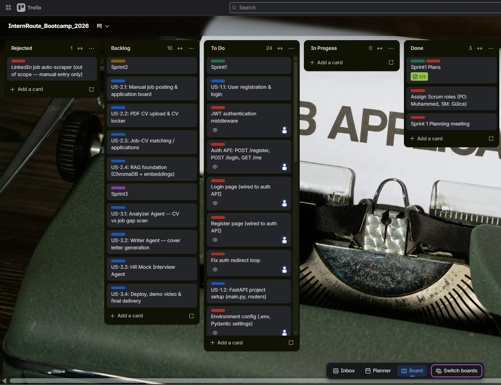

  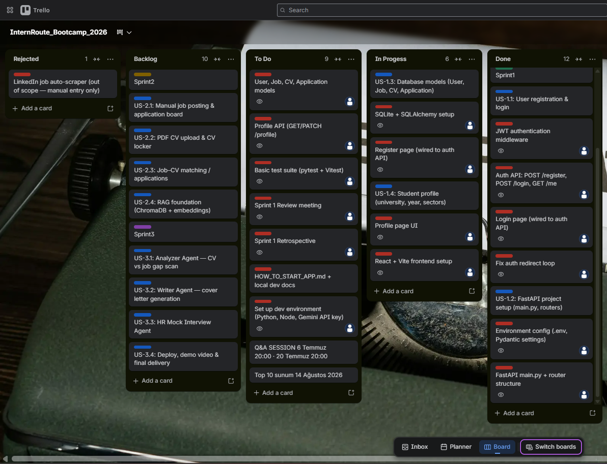

  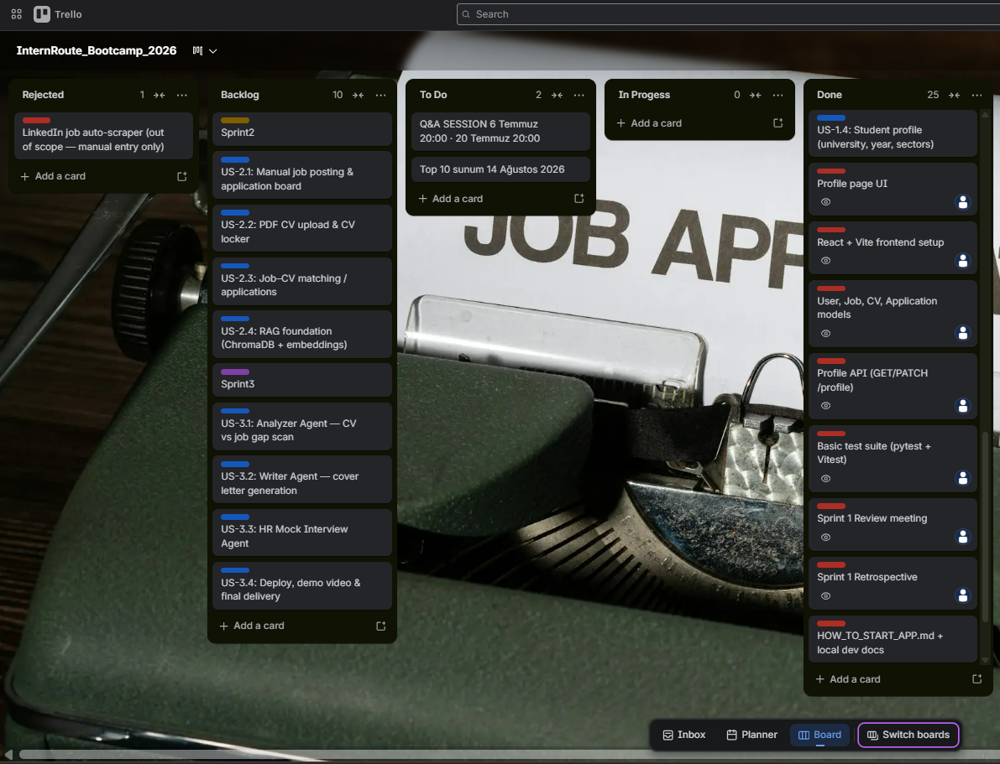

- **Product status** (screenshots):

  <p align="center">
    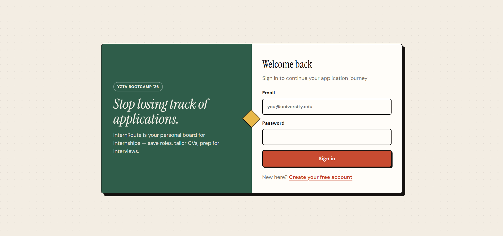
    &nbsp;
    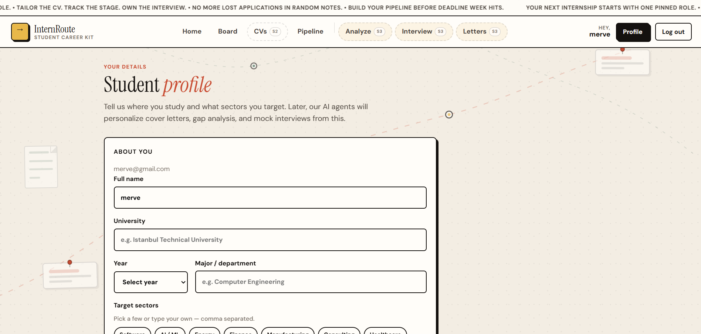
  </p>

  <p align="center">
    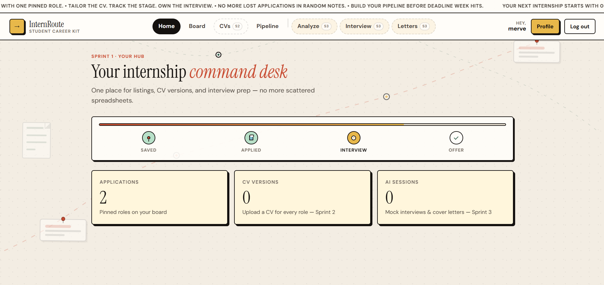
    &nbsp;
    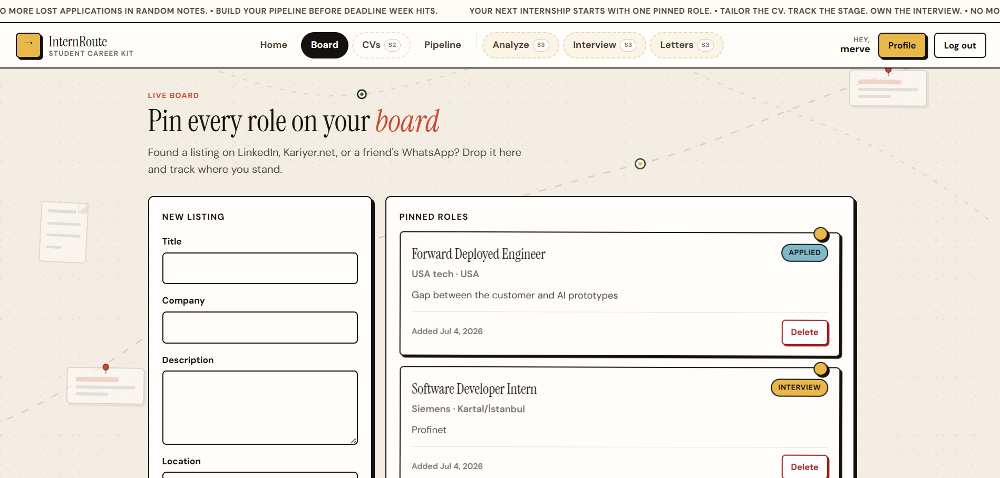
  </p>

  <p align="center">
    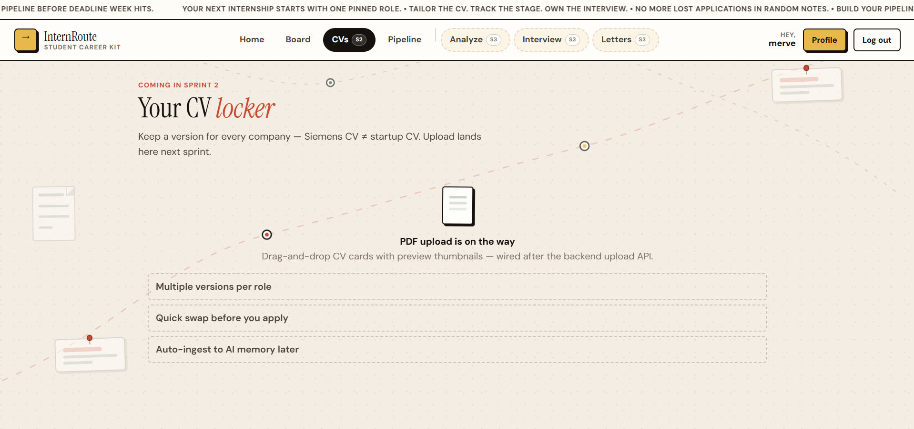
    &nbsp;
    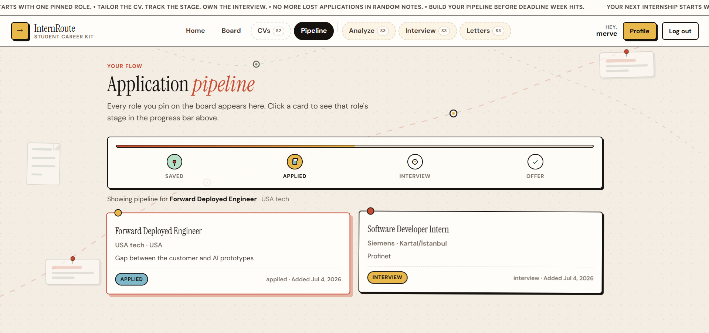
  </p>

  <p align="center">
    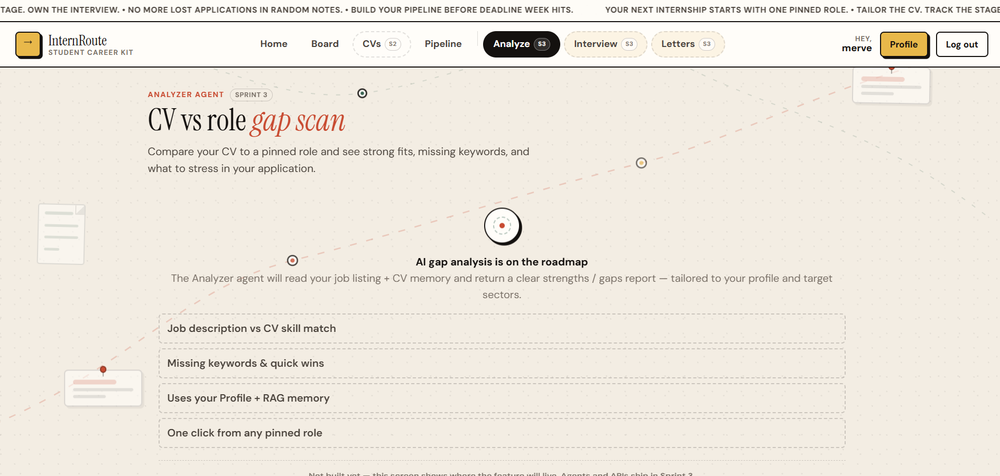
    &nbsp;
    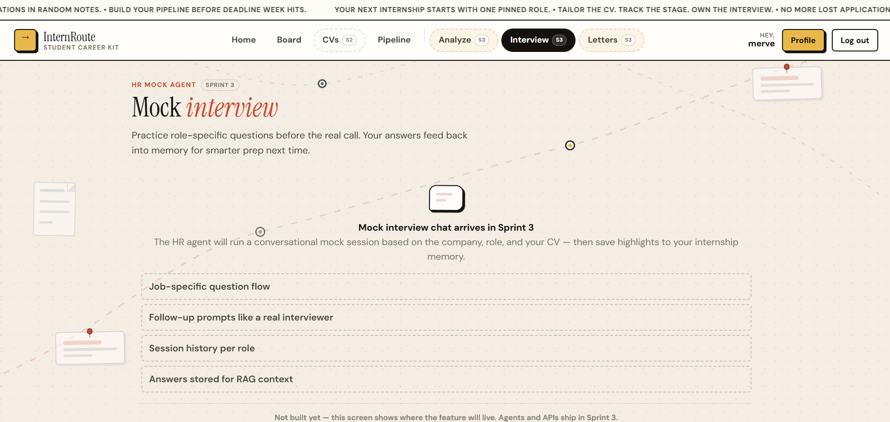
  </p>

  <p align="center">
    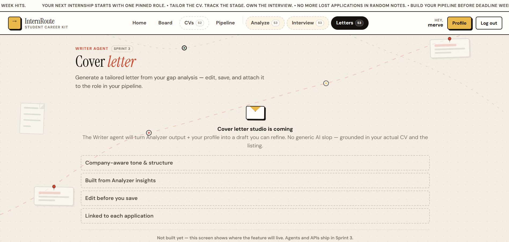
  </p>

- **Sprint Review:**  
  At sprint close we demoed the **Sprint 1 increment** of InternRoute to ourselves (PO + SM): a student can sign up, log in, and land on a protected app shell with a profile that captures university, year, and target sectors — the data Sprint 3 AI agents will need later.  
  **What we delivered:**  
  - **Auth (US-1.1):** Register, login, JWT sessions, bcrypt passwords, protected routes — full end-to-end flow.  
  - **Backend foundation (US-1.2):** FastAPI structure, health check, Swagger UI at `/docs`, environment config.  
  - **Data layer (US-1.3):** SQLite + SQLAlchemy; `User` model live; `Job`, `CV`, and `Application` models scaffolded for Sprint 2.  
  - **Student profile (US-1.4):** Profile API and UI so each applicant has a persistent identity beyond login.  
  - **Quality:** `HOW_TO_START_APP.md`, GitHub repo evidence, pytest (10) + Vitest (5) passing.  
  **Demo outcome:** Register → login → profile update ran without critical issues; API docs accessible; no blocking bugs in the demo.  
  **Moved to Sprint 2:** Manual job posting & board, PDF CV upload & CV locker, job–CV matching / applications, dashboard stats, and RAG foundation — the core “track my applications in one place” features that define InternRoute’s value after auth.  
  **Participants:** Gülce Çelik, Muhammed Enes Andiç

- **Sprint Retrospective:**  
  - **Keep:** WhatsApp and voice calls for dailies worked well for a two-person team across different schedules.  
  - **Keep:** Splitting each user story into small red task cards on Trello made progress visible day by day.  
  - **Improve:** Review story-point estimates together at Sprint 2 planning — US-2.3 and US-2.4 are larger (8 pts each) and need realistic task breakdown.  
  - **Improve:** Run pytest + Vitest before every sprint review; we added tests late in Sprint 1 and want that earlier in Sprint 2.  
  - **Team:** We continue as a two-person active unit (official 5-person bootcamp team); PO owns backlog priority, SM owns ceremonies and board hygiene — roles clarified for Sprint 2 delivery.

### Sprint 1 — technical summary

| Layer | Stack |
|-------|-------|
| **Backend** | Python 3.11+, FastAPI, SQLAlchemy, Pydantic v2, python-jose (JWT), bcrypt |
| **Database** | SQLite (`internroute.db`) |
| **Frontend** | React 19, Vite 7, TypeScript, React Router |
| **Testing** | pytest, Vitest, Testing Library, jsdom |
| **Tooling** | Git, Trello, local `.venv` + `npm` |

---

# Sprint 2

**Dates:** 6 July – 19 July 2026

- **Backlog organisation and story selection:**  
  Sprint 2 continues the same Trello Kanban flow (`Rejected → Backlog → To Do → In Progress → Done`). After auth and profile (Sprint 1), the Product Owner selected the **application-tracking core** of InternRoute: students must be able to pin roles, store CV versions, link which CV went to which job, and build a RAG memory layer for Sprint 3 agents.  
  **Sprint 2 selection:** **US-2.1 — Manual job posting & application board (5)**, **US-2.2 — PDF CV upload & CV locker (5)**, **US-2.3 — Job–CV matching / applications (8)**, **US-2.4 — RAG foundation / ChromaDB + embeddings (8)** — **26 points total**. No single story exceeds half of the sprint total (max = 8, under half of 26).  
  **Story → task split:** Blue-label stories break into red-label tasks (Job CRUD API, Board UI, CV upload API, Applications API, ChromaDB setup, memory context, tests). Process cards (Review, Retro, GitHub evidence) tracked alongside delivery.

- **Daily Scrum:**  
  We ran dailies throughout Sprint 2 (6 Jul – 19 Jul) in **WhatsApp** and **voice calls** when schedules allowed — same rhythm as Sprint 1. We tracked US-2.1–US-2.4 (job board, CV locker, applications matching, RAG foundation), broke work into Trello tasks, and prepared the **Sprint Review** and **Retrospective**. WhatsApp screenshot evidence will be added under [`ProjectManagement/Sprint2Documents/`](ProjectManagement/Sprint2Documents/) *(pending)*.

- **Sprint board update:**

  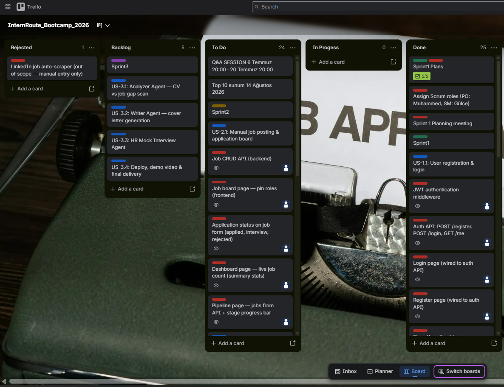

  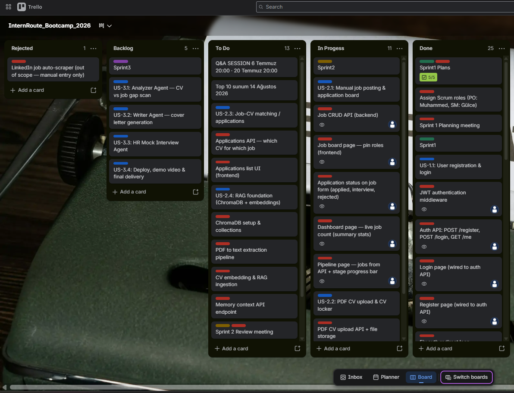

  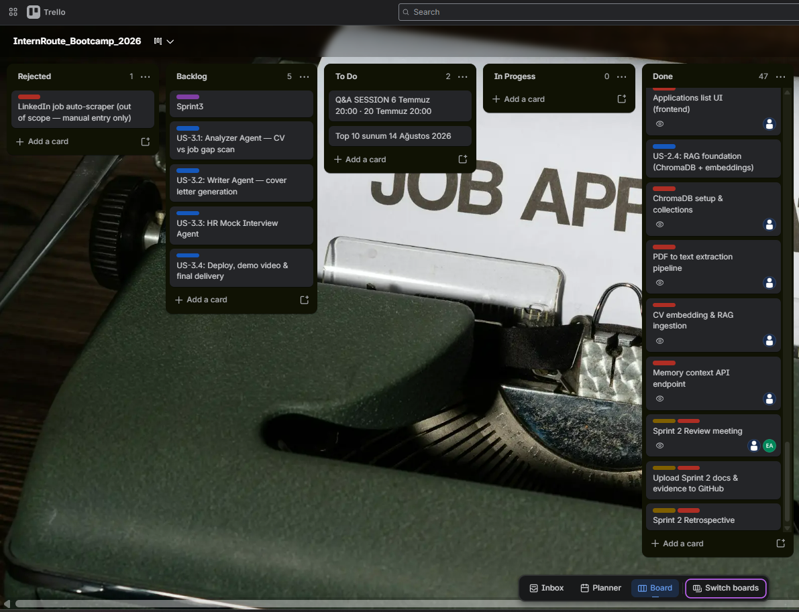

- **Product status** (screenshots):

  Sprint 2 UI screenshots will be added here after capture *(pending)*.

- **Sprint Review:**  
  At sprint close we demoed the **Sprint 2 increment**: a student can pin a role on the Board, upload a PDF to the CV locker, link that CV to the role in Pipeline (with notes / written screening Q&A), and see live counts on the Dashboard — while CV text is indexed into RAG memory for Sprint 3.  
  **What we delivered:**  
  - **Job board (US-2.1):** Job CRUD API, Board UI, application status on roles, Pipeline stage strip, Dashboard job/application stats.  
  - **CV locker (US-2.2):** PDF upload + file storage, list/view/delete; deleting a CV clears the CV link on applications but **keeps** the pipeline card so the user can reassign another CV.  
  - **Applications (US-2.3):** Job–CV matching API/UI, status updates, application notes, written screening Q&A in the Application file panel.  
  - **RAG foundation (US-2.4):** PDF → text → chunks → embeddings → ChromaDB (`internroute_cv`); `GET /memory/context`; technical preview on the CVs page (not a day-to-day student feature — for Sprint 3 agents).  
  - **Quality:** Backend pytest + frontend Vitest expanded for CVs, applications, dashboard, and CV-delete / CV-reassign flows.  
  **Demo outcome:** Board → CV upload → Pipeline link → status / notes / Q&A → Dashboard stats ran without critical blockers.  
  **Moved to Sprint 3:** Analyzer, Writer, and HR Mock Interview agents; deploy, polish, demo video.  
  **Participants:** Gülce Çelik, Muhammed Enes Andiç

- **Sprint Retrospective:**  
  - **Keep:** WhatsApp async dailies and blue story / red task cards on Trello.  
  - **Keep:** Shipping vertical slices (API + UI per story) so the Pipeline becomes usable mid-sprint.  
  - **Improve:** Clarify CV–application ownership early (delete CV must not wipe the whole application — fixed by nullable `cv_id` + reassign).  
  - **Improve:** RAG preview copy must say clearly it is for Sprint 3 agents, not a student tool; PDF extraction from designed CVs can still look messy in snippets — View PDF remains the source of truth.  
  - **Team:** Two-person active unit continues; Sprint 3 agent work needs earlier Gemini key / env checks in planning.

### Sprint 2 — technical summary

| Layer | Stack |
|-------|-------|
| **Backend** | FastAPI routes: `/jobs`, `/cvs`, `/applications`, `/dashboard/stats`, `/memory/context` |
| **Files** | Local PDF storage under `uploads/cvs/` |
| **RAG** | PyMuPDF extract · chunking · embeddings (Gemini if key set, else local) · ChromaDB |
| **Frontend** | Board, CVs locker, Pipeline (match + Q&A), Dashboard live stats |
| **Testing** | pytest (CVs, applications, auth, jobs, profile) · Vitest |

---

# Sprint 3

**Dates:** 20 July – 2 August 2026 · **Delivery deadline: 2 Aug 23:59**

### Goals

Ship the **multi-agent AI layer**, connect it to RAG memory, deploy, and record the demo.

### Backlog highlights

- LangChain agent orchestration  
- **Analyzer Agent** — `/agents/analyze`, gap report UI  
- **Writer Agent** — `/agents/cover-letter`, editable letter studio  
- **HR Mock Agent** — `/agents/mock-interview`, session history  
- RAG retriever integration; interview answers saved to memory  
- UI polish (responsive, loading, error states)  
- Deploy to live URL · Update README · 3-minute YouTube demo  
- Submit product delivery form · Sprint 3 review & retro  

### UI previews (Sprint 3 screens)

Sprint 3 UI screenshots will be added here after capture *(pending)*.

---

## Technology Stack (Full Project)

| Layer | Technology |
|-------|------------|
| **Backend** | Python, FastAPI |
| **AI Orchestration** | LangChain *(Sprint 3)* |
| **Vector Database** | ChromaDB *(Sprint 2–3)* |
| **LLM API** | Google Gemini API |
| **Frontend** | React + Vite + TypeScript |
| **Validation** | Pydantic v2 |
| **Auth** | JWT (Bearer tokens) |

---

## Getting Started

See **[HOW_TO_START_APP.md](HOW_TO_START_APP.md)** for step-by-step local setup on Windows.

Quick start:

```bash
# Backend
cd backend
python -m venv .venv
.venv\Scripts\activate          # Windows
pip install -r requirements.txt
uvicorn app.main:app --reload --port 8000

# Frontend (new terminal)
cd frontend
npm install
npm run dev
```

Copy `.env.example` to `.env` and set `SECRET_KEY` + `GEMINI_API_KEY` when working on AI features.

Run tests:

```bash
python scripts/run-all-tests.py
```

---

## Project Structure

```
InternRoute/
├── backend/                 # FastAPI app (auth, jobs, profile, agents, RAG)
├── frontend/                # React (Vite) SPA
├── ProjectManagement/       # Sprint evidence (board screenshots, daily scrum notes)
│   ├── Sprint1Documents/
│   └── Sprint2Documents/
├── docs/                    # Architecture, API design, sprint plan, screenshots
│   └── images/              # README evidence only (ui/, trello/) — not root “Trello ss/” dumps
├── scripts/                 # Test runners, git helpers, demo seed
├── .cursor/                 # Project hooks & skills
├── HOW_TO_START_APP.md
├── .env.example
└── README.md
```

Further reading: [`docs/architecture.md`](docs/architecture.md) · [`docs/api-design.md`](docs/api-design.md) · [`docs/sprint-plan.md`](docs/sprint-plan.md)

---

## License

This project is licensed under the [MIT License](LICENSE).

---

## Contact

**Repository:** [github.com/gulce-celik/InternRoute](https://github.com/gulce-celik/InternRoute)

**Contributors:** [Gülce Çelik](https://github.com/gulce-celik) · [Muhammed Enes Andiç](https://github.com/enesand)
