<p align="center">
  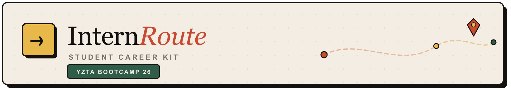
</p>

<p align="center"><strong>Your AI-powered personal career &amp; internship command center</strong></p>

<p align="center">
  <a href="https://internroute.onrender.com">
    
  </a>
</p>

<p align="center">
  <a href="https://internroute.onrender.com"><strong>https://internroute.onrender.com</strong></a><br/>
  Open the link to try the full product (UI + API + Gemini agents).<br/>
  Free tier may take ~30–60s on first wake.<br/><br/>
  <strong>🎥 Demo video:</strong> <a href="https://youtu.be/V5xFgpXODWc">https://youtu.be/V5xFgpXODWc</a>
</p>

📋 **Scrum Board:** [InternRoute Bootcamp 2026 on Trello](https://trello.com/b/yTUmFEoB/internroutebootcamp2026)

[](LICENSE)
[](https://www.python.org/)
[](https://fastapi.tiangolo.com/)
[](https://react.dev/)
[](https://internroute.onrender.com)
[](https://youtu.be/V5xFgpXODWc)

> Built with Scrum during **YZTA Bootcamp 2026** — 3 sprints × 2 weeks

---

## Team Name

**InternRoute Team** — YZTA Bootcamp 2026

---

## Team Members & Roles

| Name | Role |
|------|------|
| **Gülce Çelik** | Scrum Master & Developer |
| **Muhammed Enes Andiç** | Product Owner & Developer |

> **Note on team size:** We are officially a **5-person bootcamp team**, but we have been unable to reach our other teammates. For now, **Gülce and Muhammed are carrying the project forward** — roles above reflect who is actively contributing; the full five-person role split may be updated if others rejoin.

---

## Product Name

**InternRoute**

---

## Product Description

**InternRoute** is not a job search engine or web scraper. It is a **personal career operating system** for students and early-career applicants who find internships and jobs on LinkedIn, Kariyer.net, company sites, or referrals — and need one place to **organize**, **track**, and **prepare**.

Users manually add the roles they care about, upload **role-specific CV versions**, and track each application through stages (saved → applied → interview → offer). Over time, the platform builds a **memory layer (RAG)** from CVs and interview answers, then uses **multi-agent AI** to:

- Analyze gaps between a CV and a job listing  
- Draft tailored cover letters  
- Run mock HR interviews for a specific role  

The goal is simple: **stop losing applications in random notes** and walk into every interview prepared.

### How it works

```
┌─────────────┐     ┌──────────────┐     ┌─────────────────┐
│  Job + CV   │────▶│  Dashboard   │────▶│  Memory (RAG)   │
│  Upload     │     │  & Pipeline  │     │  Vector DB      │
└─────────────┘     └──────────────┘     └────────┬────────┘
                                                  │
                    ┌─────────────────────────────┼─────────────────────────────┐
                    ▼                             ▼                             ▼
            ┌───────────────┐           ┌─────────────────┐           ┌─────────────────┐
            │ Analyzer      │──────────▶│ Writer Agent    │           │ HR Mock Agent   │
            │ Gap analysis  │           │ Cover letter    │           │ Mock interview  │
            └───────────────┘           └─────────────────┘           └─────────────────┘
```

---

## Product Features

### Delivered in Sprint 1

| Feature | Description |
|---------|-------------|
| **Auth** | Register, login, JWT sessions, protected routes |
| **Student profile** | University, year, major, target sectors — foundation for Sprint 3 AI personalization |
| **React app shell** | Login, Register, layout, navigation, Sprint 2/3 placeholder screens |
| **API docs** | Interactive Swagger UI at `/docs` |
| **Tests** | Backend pytest (10) + frontend Vitest (5) |
| **Database scaffold** | User model live; Job, CV, Application models prepared for Sprint 2 |

### Delivered in Sprint 2 (Jul 6 – 19)

| Feature | Description |
|---------|-------------|
| **Job board** | Manual job posting CRUD, pin roles, application status |
| **Application pipeline** | Job–CV matching, status flow, notes + written screening Q&A |
| **Dashboard** | Live summary stats for applications, CV versions, offers |
| **CV locker** | PDF upload, view, delete; CV can be reassigned on applications |
| **RAG foundation** | ChromaDB, PDF → text → chunks → embeddings, memory context API |

### Delivered in Sprint 3 (Jul 20 – Aug 2)

| Feature | Description |
|---------|-------------|
| **Analyzer Agent** | CV vs job gap scan (Job+CV / Pipeline), RAG-backed fit score, strengths, gaps, keywords |
| **Writer Agent** | Cover letter studio — tone, analyzer notes, edit mode, Save PDF |
| **HR Mock Agent** | Role-specific mock interview chat, coaching feedback, session history |
| **Interview Calendar** | Month view + categories (HR/tech/AI interview, aptitude, language, case study) |
| **UI polish** | Unified agent pages, Board edit/search, status labels, dashboard AI links |
| **Deploy** | Live URL on Render — [https://internroute.onrender.com](https://internroute.onrender.com) |
| **Demo video** | Final project walkthrough — [https://youtu.be/V5xFgpXODWc](https://youtu.be/V5xFgpXODWc) |

---

## Target Audience

- **University students** applying for internships and new-grad roles  
- **Early-career applicants** juggling multiple tailored CVs and deadlines  
- **Bootcamp / self-learners** who want structured application tracking without a generic spreadsheet  
- **Age range:** roughly **18–28** — anyone actively building their first professional pipeline  

---

## Product Backlog

📋 **[InternRoute Bootcamp 2026 — Trello Board](https://trello.com/b/yTUmFEoB/internroutebootcamp2026)**

---

## Bootcamp Sprint Calendar

| Sprint | Dates | Focus |
|--------|-------|-------|
| **Sprint 1** | 19 Jun – 5 Jul 2026 | Auth, FastAPI core, React shell, basic UI |
| **Sprint 2** | 6 Jul – 19 Jul 2026 | Jobs, CV upload, applications, RAG pipeline |
| **Sprint 3 (Delivery)** | 20 Jul – 2 Aug 2026 | AI agents, polish, deploy, demo video |

**Final delivery:** 2 August 2026, 23:59 · **Top 10 presentations:** 14 August 2026

---

# Sprint 1

**Dates:** 19 June – 5 July 2026

- **Backlog organisation and story selection:**  
  Our product backlog on Trello is ordered by **business priority** for InternRoute: authentication and project foundation first, because every later feature (job board, CV locker, RAG memory, AI agents) depends on a logged-in student with a profile. Columns follow Kanban flow: `Rejected → Backlog → To Do → In Progress → Done`.  
  **Sprint 1 selection:** The Product Owner pulled user stories into **To Do** for 19 Jun – 5 Jul without exceeding team capacity. Selected stories and points: **US-1.1 — User registration & login (5)**, **US-1.2 — FastAPI project setup (3)**, **US-1.3 — Database models (5)**, **US-1.4 — Student profile (3)** — **16 points total**. No single story exceeds half of the sprint total (max = 5, under half of 16).  
  **Out of scope (Rejected):** LinkedIn auto-scraper — InternRoute is a *personal career OS* with **manual** job entry, not a scraping tool.  
  **Story → task split:** Each blue-label **user story** (`US-x.x`) breaks into red-label **tasks** (API, UI, config, tests). Example: US-1.1 includes auth API, JWT middleware, login page, and register page as separate task cards.

- **Daily Scrum:**  
  We ran dailies throughout Sprint 1 (19 Jun – 5 Jul) in **WhatsApp** and **voice calls** when schedules allowed — no fixed daily call time, but we synced by chat most days and jumped on a quick voice talk when something needed a faster decision. In these syncs we planned the sprint scope (US-1.1–US-1.4), broke user stories into Trello tasks, tracked progress, and prepared the **Sprint Review** and **Retrospective**. This README section is the concise record of what we aligned on (planning decisions, progress, and blockers) across the sprint.

- **Sprint board update:**

  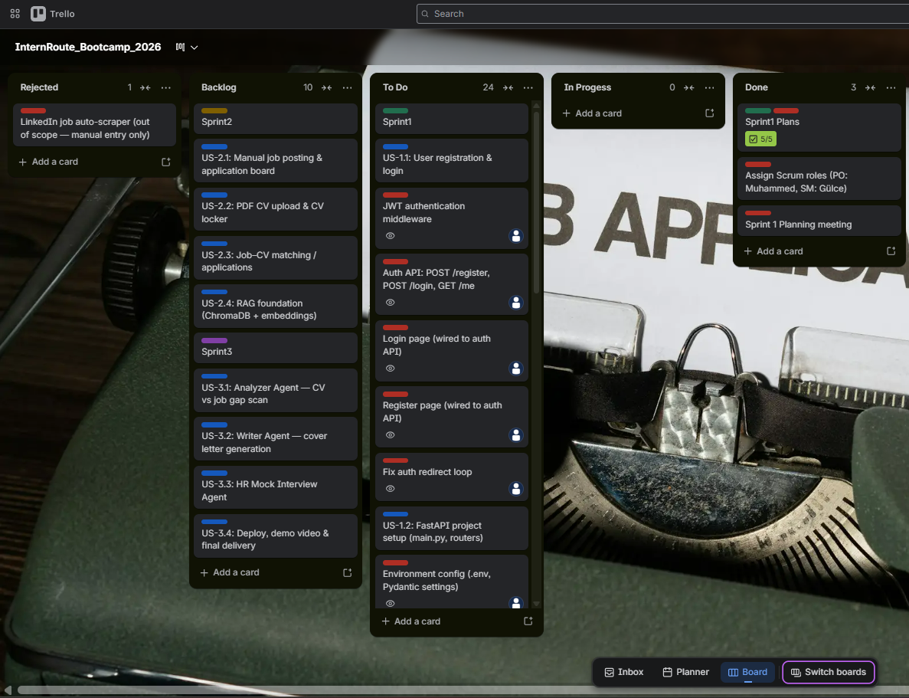

  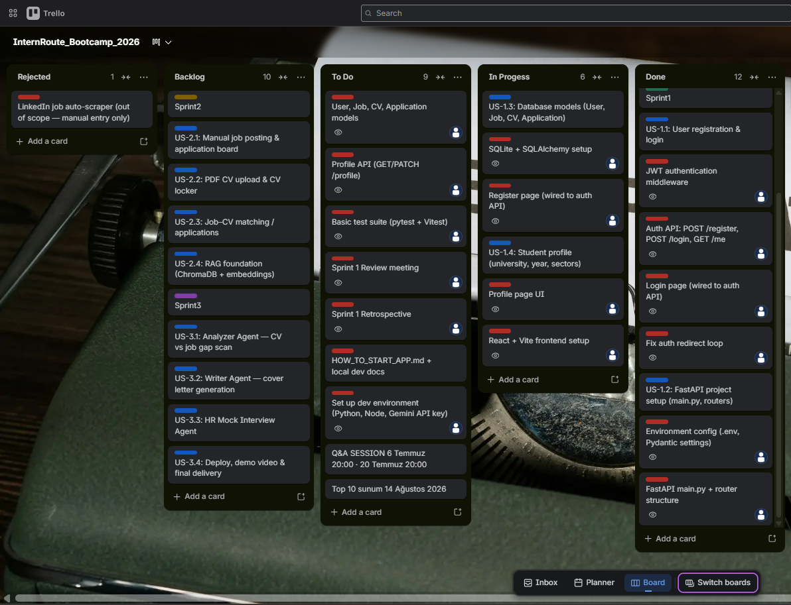

  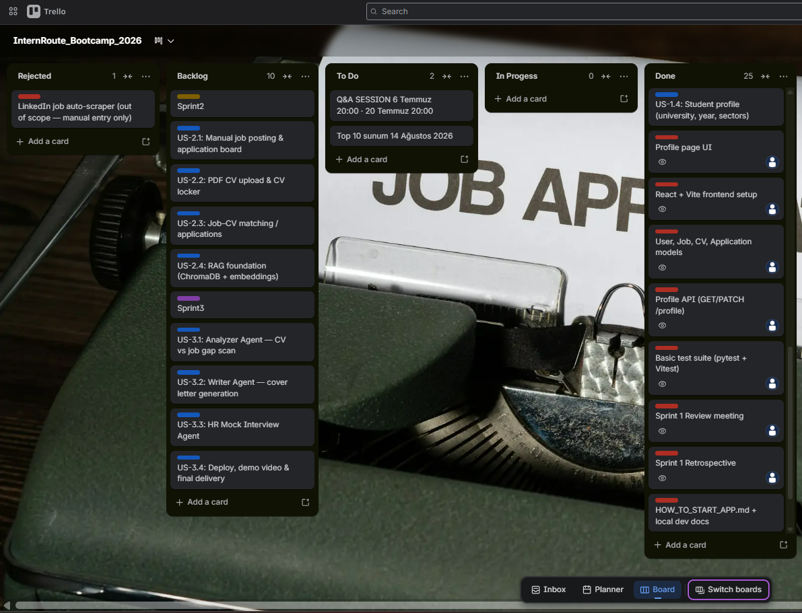

- **Product status** (screenshots):

  <p align="center">
    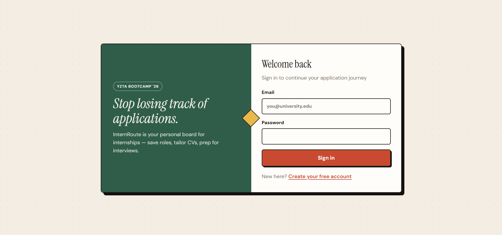
    &nbsp;
    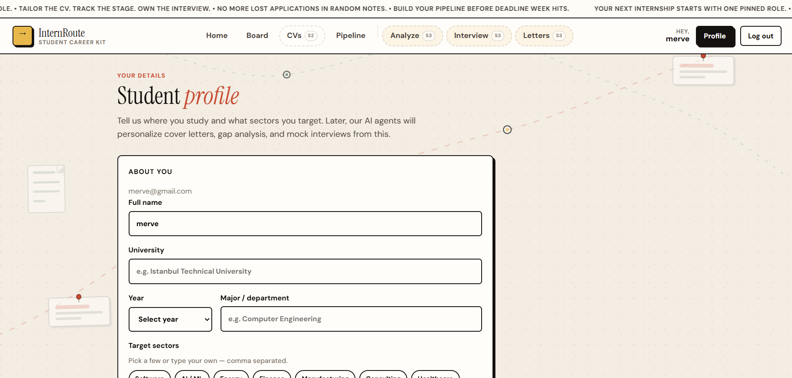
  </p>

  <p align="center">
    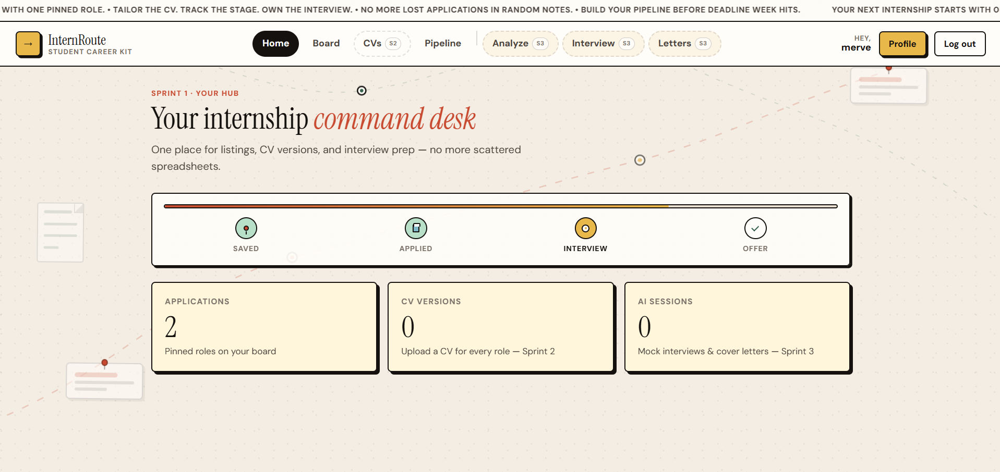
    &nbsp;
    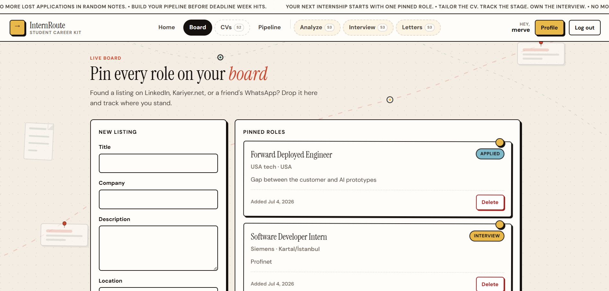
  </p>

  <p align="center">
    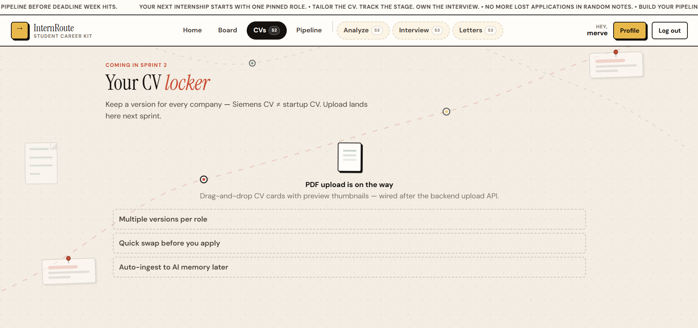
    &nbsp;
    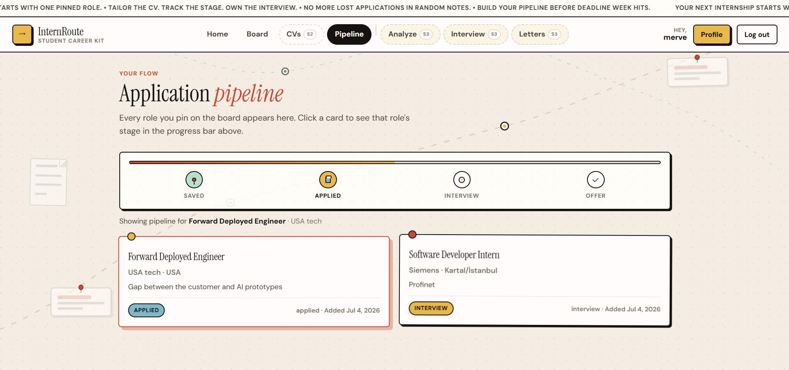
  </p>

  <p align="center">
    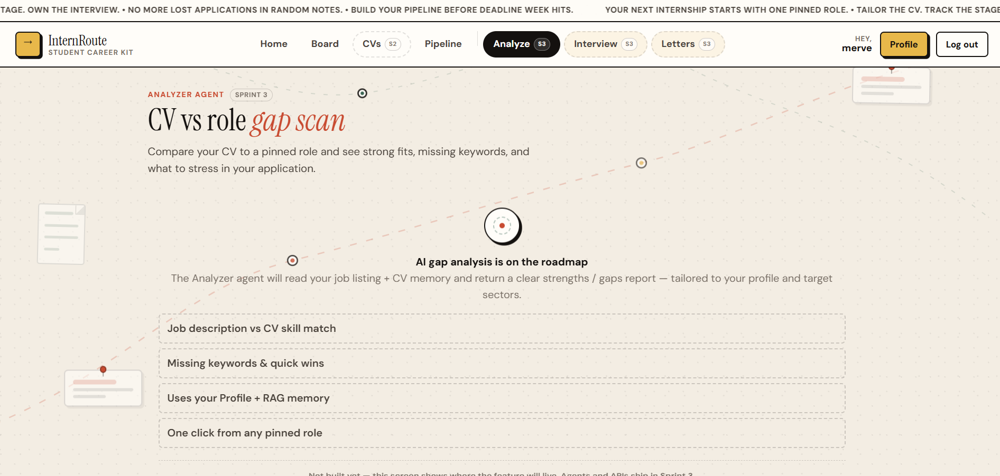
    &nbsp;
    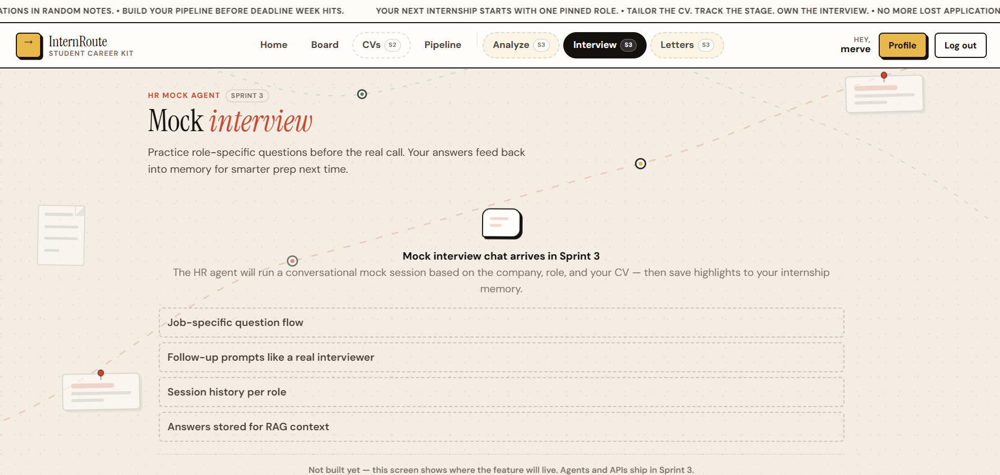
  </p>

  <p align="center">
    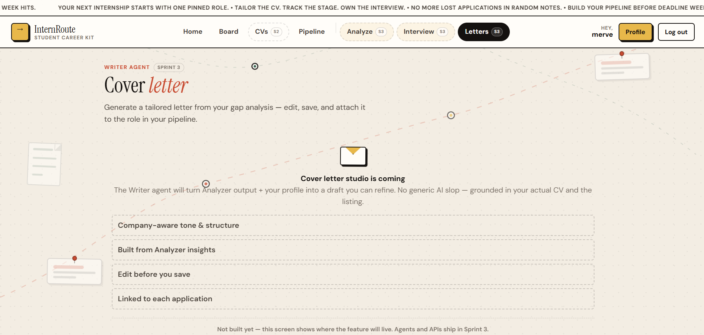
  </p>

- **Sprint Review:**  
  At sprint close we demoed the **Sprint 1 increment** of InternRoute to ourselves (PO + SM): a student can sign up, log in, and land on a protected app shell with a profile that captures university, year, and target sectors — the data Sprint 3 AI agents will need later.  
  **What we delivered:**  
  - **Auth (US-1.1):** Register, login, JWT sessions, bcrypt passwords, protected routes — full end-to-end flow.  
  - **Backend foundation (US-1.2):** FastAPI structure, health check, Swagger UI at `/docs`, environment config.  
  - **Data layer (US-1.3):** SQLite + SQLAlchemy; `User` model live; `Job`, `CV`, and `Application` models scaffolded for Sprint 2.  
  - **Student profile (US-1.4):** Profile API and UI so each applicant has a persistent identity beyond login.  
  - **Quality:** `HOW_TO_START_APP.md`, GitHub repo evidence, pytest (10) + Vitest (5) passing.  
  **Demo outcome:** Register → login → profile update ran without critical issues; API docs accessible; no blocking bugs in the demo.  
  **Moved to Sprint 2:** Manual job posting & board, PDF CV upload & CV locker, job–CV matching / applications, dashboard stats, and RAG foundation — the core “track my applications in one place” features that define InternRoute’s value after auth.  
  **Participants:** Gülce Çelik, Muhammed Enes Andiç

- **Sprint Retrospective:**  
  - **Keep:** WhatsApp and voice calls for dailies worked well for a two-person team across different schedules.  
  - **Keep:** Splitting each user story into small red task cards on Trello made progress visible day by day.  
  - **Improve:** Review story-point estimates together at Sprint 2 planning — US-2.3 and US-2.4 are larger (8 pts each) and need realistic task breakdown.  
  - **Improve:** Run pytest + Vitest before every sprint review; we added tests late in Sprint 1 and want that earlier in Sprint 2.  
  - **Team:** We continue as a two-person active unit (official 5-person bootcamp team); PO owns backlog priority, SM owns ceremonies and board hygiene — roles clarified for Sprint 2 delivery.

### Sprint 1 — technical summary

| Layer | Stack |
|-------|-------|
| **Backend** | Python 3.11+, FastAPI, SQLAlchemy, Pydantic v2, python-jose (JWT), bcrypt |
| **Database** | SQLite (`internroute.db`) |
| **Frontend** | React 19, Vite 7, TypeScript, React Router |
| **Testing** | pytest, Vitest, Testing Library, jsdom |
| **Tooling** | Git, Trello, local `.venv` + `npm` |

---

# Sprint 2

**Dates:** 6 July – 19 July 2026

- **Backlog organisation and story selection:**  
  Sprint 2 continues the same Trello Kanban flow (`Rejected → Backlog → To Do → In Progress → Done`). After auth and profile (Sprint 1), the Product Owner selected the **application-tracking core** of InternRoute: students must be able to pin roles, store CV versions, link which CV went to which job, and build a RAG memory layer for Sprint 3 agents.  
  **Sprint 2 selection:** **US-2.1 — Manual job posting & application board (5)**, **US-2.2 — PDF CV upload & CV locker (5)**, **US-2.3 — Job–CV matching / applications (8)**, **US-2.4 — RAG foundation / ChromaDB + embeddings (8)** — **26 points total**. No single story exceeds half of the sprint total (max = 8, under half of 26).  
  **Story → task split:** Blue-label stories break into red-label tasks (Job CRUD API, Board UI, CV upload API, Applications API, ChromaDB setup, memory context, tests). Process cards (Review, Retro, GitHub evidence) tracked alongside delivery.

- **Daily Scrum:**  
  We ran dailies throughout Sprint 2 (6 Jul – 19 Jul) in **WhatsApp** and **voice calls** when schedules allowed — same rhythm as Sprint 1. We tracked US-2.1–US-2.4 (job board, CV locker, applications matching, RAG foundation), broke work into Trello tasks, and prepared the **Sprint Review** and **Retrospective**. WhatsApp screenshot evidence are added under [`ProjectManagement/Sprint2Documents/dailyscrum-ss-whatsapp`]

- **Sprint board update:**

  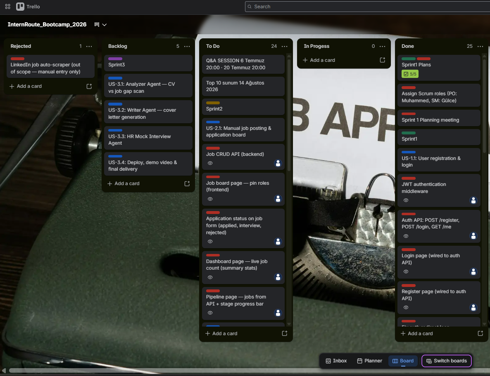

  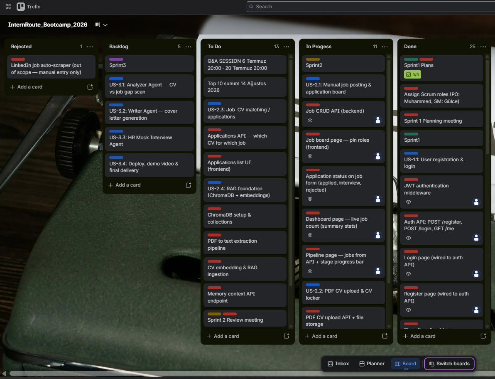

  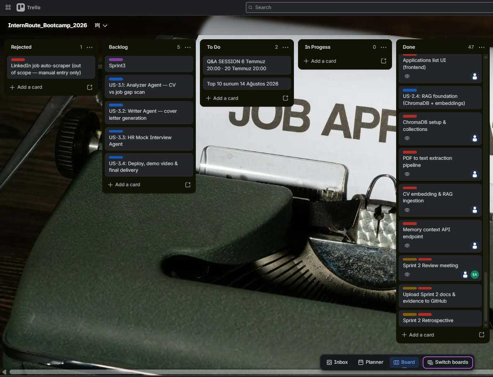

- **Product status** (screenshots):

  <p align="center">
    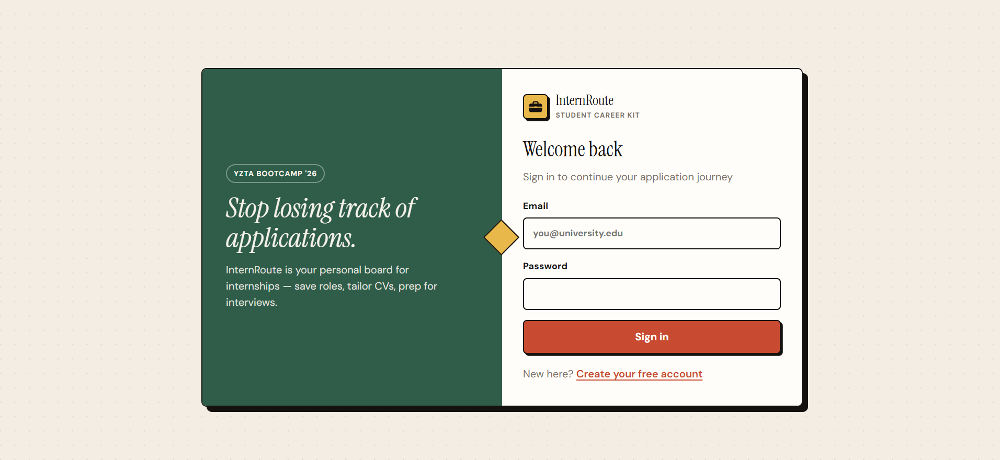
    &nbsp;
    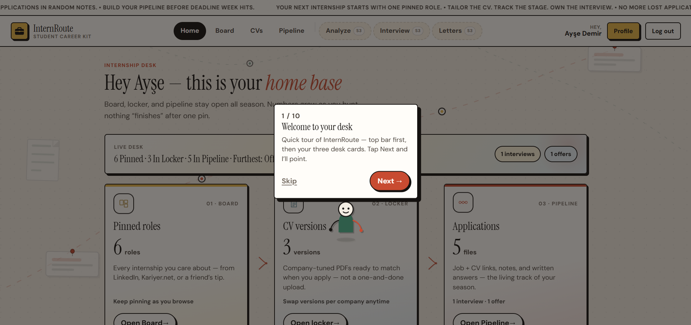
  </p>

  <p align="center">
    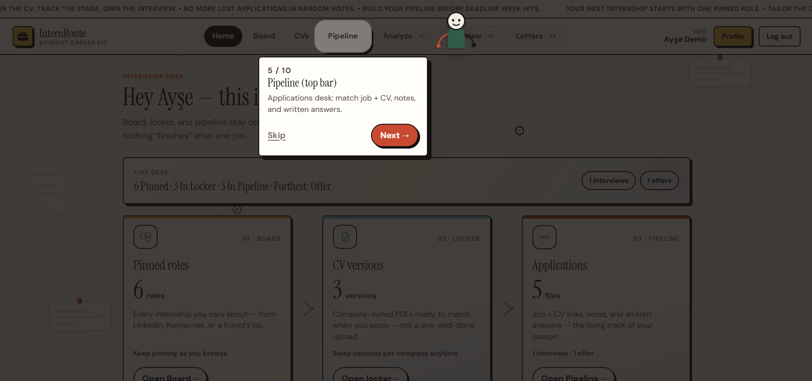
    &nbsp;
    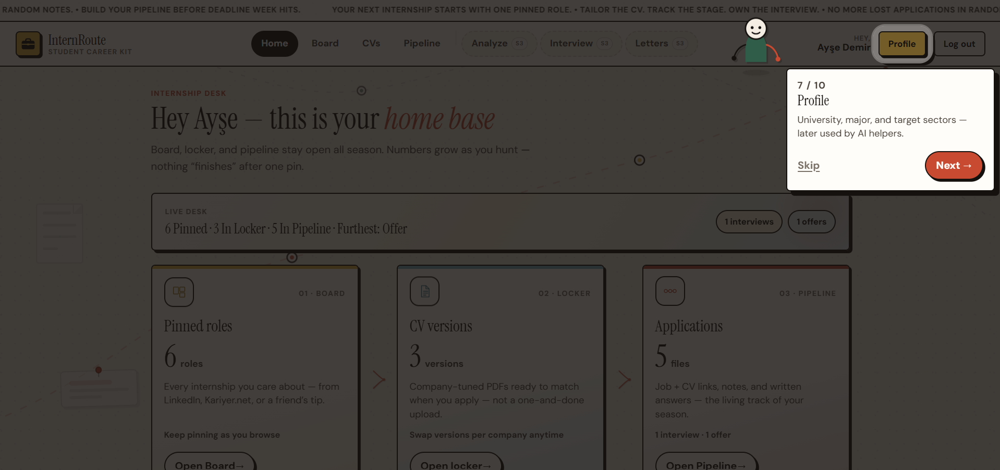
  </p>

  <p align="center">
    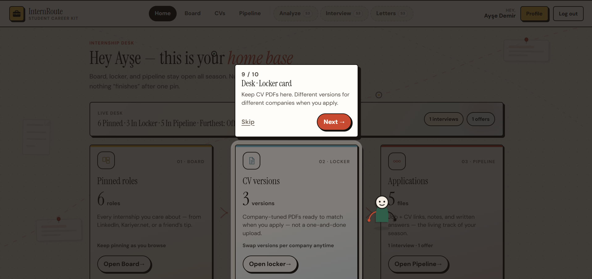
    &nbsp;
    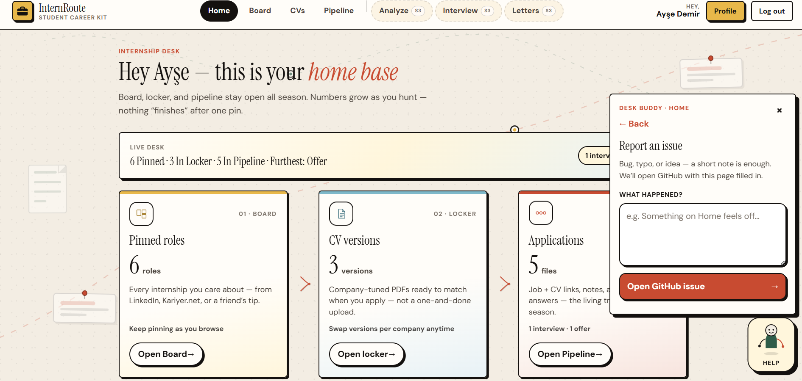
  </p>

  <p align="center">
    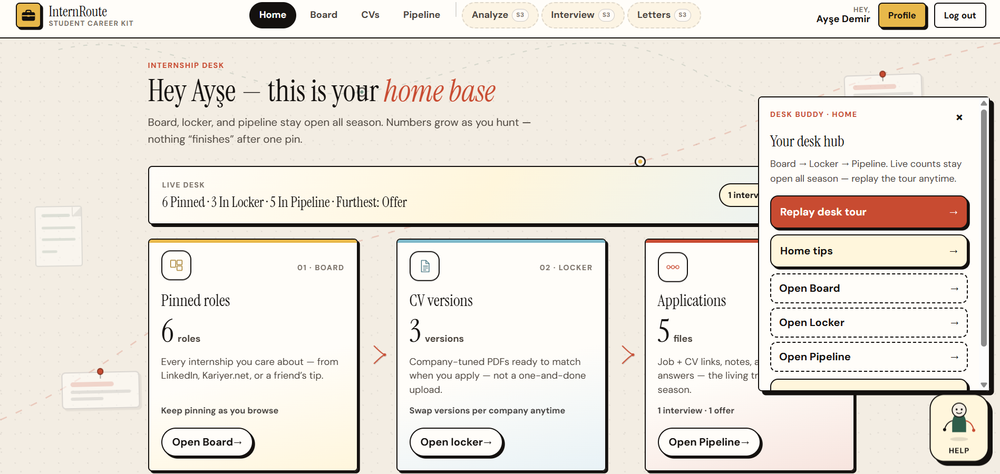
    &nbsp;
    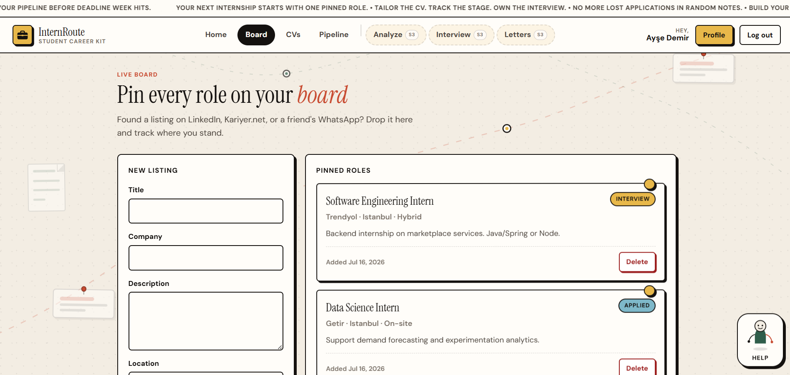
  </p>

  <p align="center">
    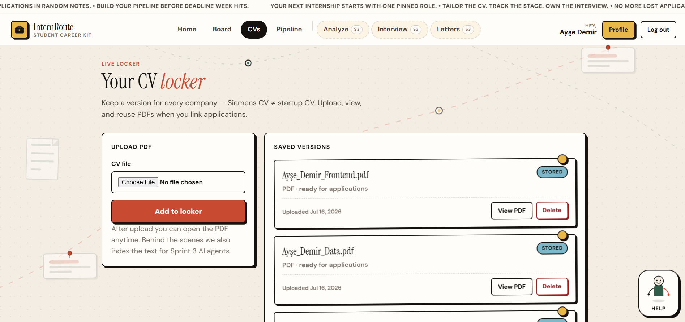
    &nbsp;
    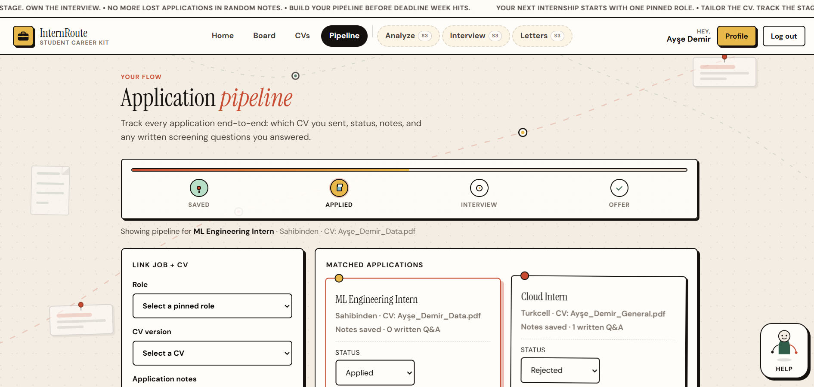
  </p>

  <p align="center">
    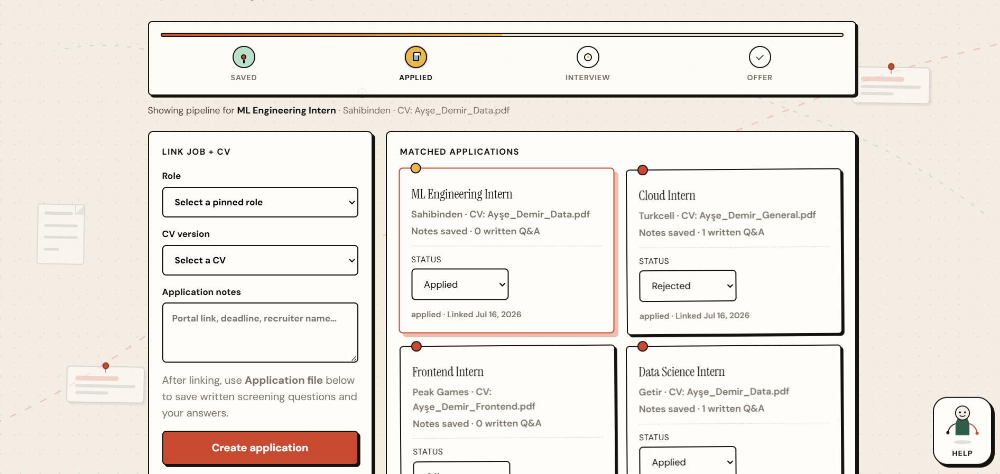
    &nbsp;
    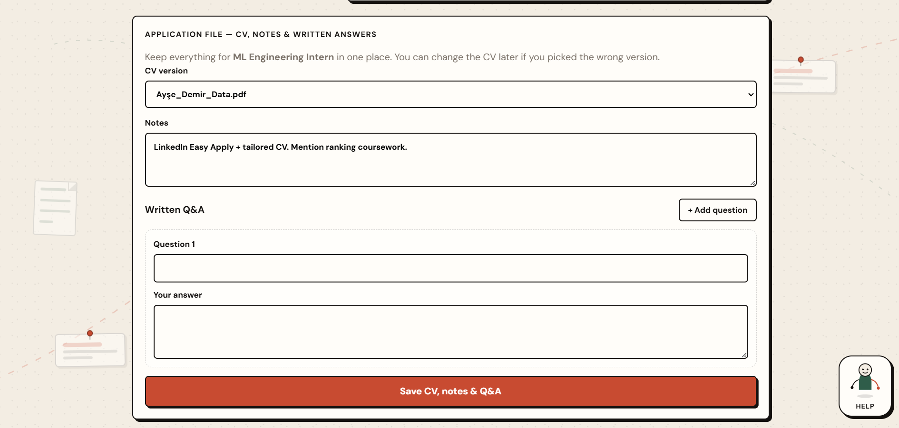
  </p>

  <p align="center">
    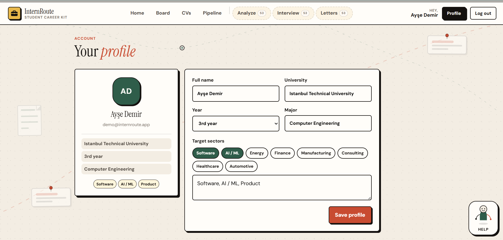
    &nbsp;
    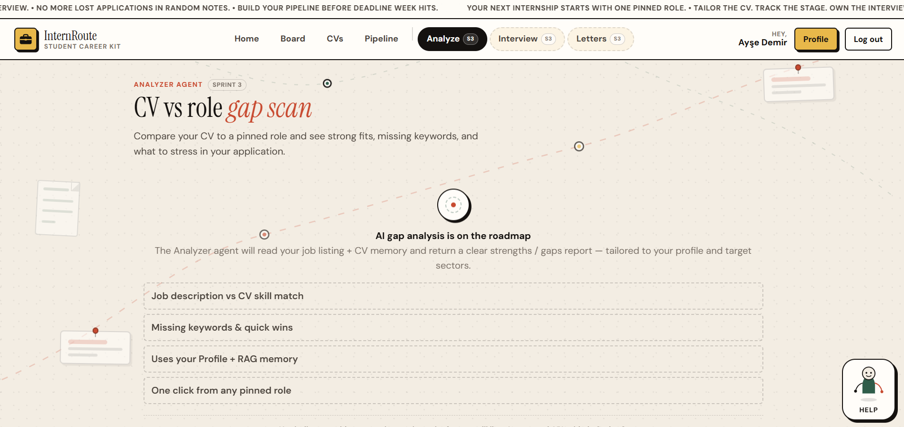
  </p>

  <p align="center">
    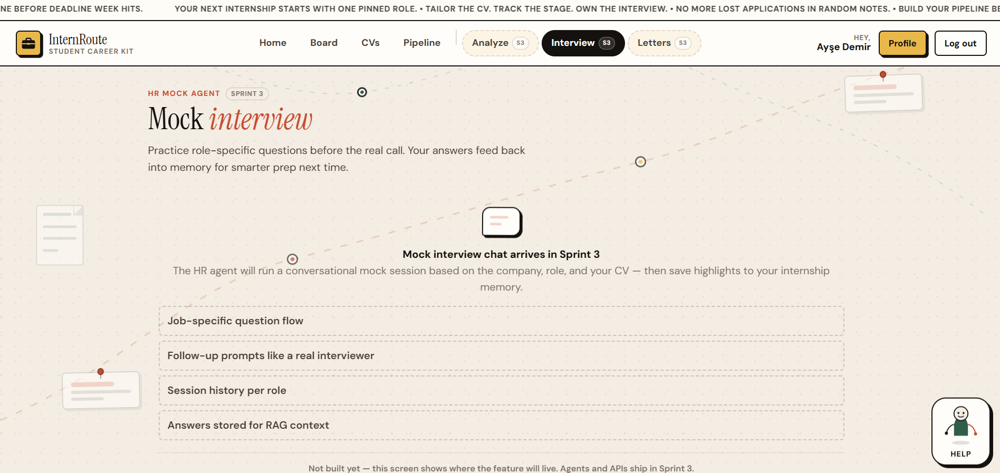
    &nbsp;
    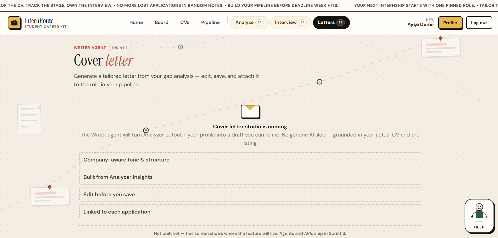
  </p>

- **Sprint Review:**  
  At sprint close we demoed the **Sprint 2 increment**: a student can pin a role on the Board, upload a PDF to the CV locker, link that CV to the role in Pipeline (with notes / written screening Q&A), and see live counts on the Dashboard — while CV text is indexed into RAG memory for Sprint 3.  
  **What we delivered:**  
  - **Job board (US-2.1):** Job CRUD API, Board UI, application status on roles, Pipeline stage strip, Dashboard job/application stats.  
  - **CV locker (US-2.2):** PDF upload + file storage, list/view/delete; deleting a CV clears the CV link on applications but **keeps** the pipeline card so the user can reassign another CV.  
  - **Applications (US-2.3):** Job–CV matching API/UI, status updates, application notes, written screening Q&A in the Application file panel.  
  - **RAG foundation (US-2.4):** PDF → text → chunks → embeddings → ChromaDB (`internroute_cv`); `GET /memory/context`; technical preview on the CVs page (not a day-to-day student feature — for Sprint 3 agents).  
  - **Quality:** Backend pytest + frontend Vitest expanded for CVs, applications, dashboard, and CV-delete / CV-reassign flows.  
  **Demo outcome:** Board → CV upload → Pipeline link → status / notes / Q&A → Dashboard stats ran without critical blockers.  
  **Moved to Sprint 3:** Analyzer, Writer, and HR Mock Interview agents; deploy, polish, demo video.  
  **Participants:** Gülce Çelik, Muhammed Enes Andiç

- **Sprint Retrospective:**  
  - **Keep:** WhatsApp async dailies and blue story / red task cards on Trello.  
  - **Keep:** Shipping vertical slices (API + UI per story) so the Pipeline becomes usable mid-sprint.  
  - **Improve:** Clarify CV–application ownership early (delete CV must not wipe the whole application — fixed by nullable `cv_id` + reassign).  
  - **Improve:** RAG preview copy must say clearly it is for Sprint 3 agents, not a student tool; PDF extraction from designed CVs can still look messy in snippets — View PDF remains the source of truth.  
  - **Team:** Two-person active unit continues; Sprint 3 agent work needs earlier Gemini key / env checks in planning.

### Sprint 2 — technical summary

| Layer | Stack |
|-------|-------|
| **Backend** | FastAPI routes: `/jobs`, `/cvs`, `/applications`, `/dashboard/stats`, `/memory/context` |
| **Files** | Local PDF storage under `uploads/cvs/` |
| **RAG** | PyMuPDF extract · chunking · embeddings (Gemini if key set, else local) · ChromaDB |
| **Frontend** | Board, CVs locker, Pipeline (match + Q&A), Dashboard live stats |
| **Testing** | pytest (CVs, applications, auth, jobs, profile) · Vitest |

---

# Sprint 3

**Dates:** 20 July – 2 August 2026 · **Delivery deadline: 2 Aug 23:59**

- **Backlog organisation and story selection:**  
  Sprint 3 continues the same Trello Kanban flow (`Rejected → Backlog → To Do → In Progress → Done`). With auth, board, CV locker, pipeline, and RAG memory in place (Sprints 1–2), the Product Owner pulled the **multi-agent AI + delivery** slice into Sprint 3.  
  **Sprint 3 selection:** **US-3.1 — Analyzer Agent / CV vs job gap scan (8)**, **US-3.2 — Writer Agent / cover letter generation (8)**, **US-3.3 — HR Mock Interview Agent (13)**, **US-3.4 — Deploy, demo video & final delivery (5)**, **US-3.5 — Interview Calendar (5)** — **39 points total**. No single story exceeds half of the sprint total (max = 13, under half of 39).  
  **Story → task split:** Blue-label stories break into red-label tasks (shared Gemini LLM client, `/agents/analyze`, gap report UI, cover-letter API/studio/PDF, mock-interview sessions + coaching UI, calendar API/month UI, Render Docker deploy, tests). Process cards (Review, Retro, GitHub evidence) tracked alongside delivery.

- **Daily Scrum:**  
  We ran dailies throughout Sprint 3 (20 Jul – 2 Aug) in **WhatsApp** and **voice calls** when schedules allowed — same rhythm as Sprints 1–2. We tracked US-3.1–US-3.5 (analyzer, writer, mock interview, calendar, deploy/polish), broke work into Trello tasks, and prepared the **Sprint Review** and **Retrospective**. WhatsApp screenshot evidence are added under [`ProjectManagement/Sprint3Documents/dailyscrum-ss-whatsapp`](ProjectManagement/Sprint3Documents/dailyscrum-ss-whatsapp).

- **Sprint board update:**

  <p align="center">
    
    &nbsp;
    
    &nbsp;
    
  </p>

  <p align="center">
    
    &nbsp;
    
  </p>

- **Product status** (screenshots):

  <table>
  <tr>
  <td width="50%" valign="top" align="center">
  <br/>
  <sub><b>Home — Internship Desk (tour)</b><br/>Welcome modal (1/8) over Board · Locker · Pipeline cards.</sub>
  </td>
  <td width="50%" valign="top" align="center">
  <br/>
  <sub><b>Home — Internship Desk</b><br/>Live summary bar and the three desk cards (pinned roles, CVs, applications).</sub>
  </td>
  </tr>
  <tr>
  <td width="50%" valign="top" align="center">
  <br/>
  <sub><b>Home — AI tools strip</b><br/>Quick links to Analyze, Letters, and Interview under the desk cards.</sub>
  </td>
  <td width="50%" valign="top" align="center">
  <br/>
  <sub><b>Calendar — month view</b><br/>Color-coded deadlines &amp; tests (aptitude, HR/tech/AI interview, case study, …).</sub>
  </td>
  </tr>
  <tr>
  <td width="50%" valign="top" align="center">
  <br/>
  <sub><b>Calendar — day detail</b><br/>Selected date sidebar with linked role/application and Add Event form.</sub>
  </td>
  <td width="50%" valign="top" align="center">
  <br/>
  <sub><b>Workspace — Job Board</b><br/>Pin roles, search/filter by status, edit or delete listings.</sub>
  </td>
  </tr>
  <tr>
  <td width="50%" valign="top" align="center">
  <br/>
  <sub><b>Workspace — CV Locker</b><br/>Upload named PDF versions and view/delete saved CVs.</sub>
  </td>
  <td width="50%" valign="top" align="center">
  <br/>
  <sub><b>Workspace — Application Pipeline</b><br/>Link job + CV, stage strip, matched applications with status.</sub>
  </td>
  </tr>
  <tr>
  <td width="50%" valign="top" align="center">
  <br/>
  <sub><b>Analyzer — Gap scan report</b><br/>Fit score, summary, strengths/gaps, past sessions, copy for cover letter.</sub>
  </td>
  <td width="50%" valign="top" align="center">
  <br/>
  <sub><b>Analyzer — Keywords &amp; recommendations</b><br/>Keywords to add and actionable tips after a CV vs role scan.</sub>
  </td>
  </tr>
  <tr>
  <td width="50%" valign="top" align="center">
  <br/>
  <sub><b>Writer — Cover letter studio</b><br/>Draft settings, generated letter, Edit / Save PDF / Copy, past sessions.</sub>
  </td>
  <td width="50%" valign="top" align="center">
  <br/>
  <sub><b>Writer — Edit mode</b><br/>Inline edit of subject + body, then Done / Save PDF / Copy.</sub>
  </td>
  </tr>
  <tr>
  <td width="50%" valign="top" align="center">
  <br/>
  <sub><b>Interview — HR Mock Agent start</b><br/>Pick role + CV, how-it-works, past practice sessions.</sub>
  </td>
  <td width="50%" valign="top" align="center">
  <br/>
  <sub><b>Interview — Live mock chat</b><br/>Question progress, interviewer prompt, answer box, STAR coaching rail.</sub>
  </td>
  </tr>
  <tr>
  <td width="50%" valign="top" align="center">
  <br/>
  <sub><b>Interview — Mid-session feedback</b><br/>Follow-up question with latest coaching feedback on the previous answer.</sub>
  </td>
  <td width="50%" valign="top" align="center">
  <br/>
  <sub><b>Interview — Session complete</b><br/>Practice-round done, session summary + strengths, Practice again / Open Pipeline.</sub>
  </td>
  </tr>
  <tr>
  <td width="50%" valign="top" align="center">
  <br/>
  <sub><b>Interview — Coaching rail detail</b><br/>Strengths, improvements, and practice tips after a mock round.</sub>
  </td>
  <td width="50%" valign="top" align="center">
  <br/>
  <sub><b>Account — Student profile</b><br/>University, year, major, and target sectors used by the AI agents.</sub>
  </td>
  </tr>
  </table>

- **Sprint Review:**  
  At sprint close we demoed the **Sprint 3 increment** on the live app ([https://internroute.onrender.com](https://internroute.onrender.com)): a student can run a **CV vs job gap scan**, draft an editable **cover letter** (with PDF export), complete a **mock HR interview** with coaching feedback, schedule prep events on the **Calendar**, and move through Board → Pipeline with polished UI — all backed by Sprint 2 RAG memory + Gemini.  
  **What we delivered:**  
  - **Analyzer (US-3.1):** Shared Gemini LLM client; `/agents/analyze`; RAG retriever for CV memory; Analyze page (Job+CV / Pipeline sources); fit score / strengths / gaps / keywords UI; past scan sessions; copy-to-cover-letter; analyzer tests.  
  - **Writer (US-3.2):** `/agents/cover-letter`; Letter studio (tone, analyzer summary, notes); Pipeline-aware drafts; session history; edit mode + Save PDF; writer tests.  
  - **HR Mock Interview (US-3.3):** Interview session models + API (`start` / `answer` / list / get); Interview page with coaching rail; Pipeline deep link; Desk Buddy interview guidance; session/schema tests; Interview removed from “coming soon”.  
  - **Calendar (US-3.5):** Calendar API + month UI; event categories (aptitude, language, case study, AI/HR/tech/team interview); Board / Pipeline event forms; navbar Calendar.  
  - **Deploy & polish (US-3.4):** UI unify (agent pages, loading/empty states, status labels); Board edit + search; Dashboard AI tool links; single-service **Docker deploy on Render** (UI + API same origin); README + Sprint 3 evidence; **demo video** — [https://youtu.be/V5xFgpXODWc](https://youtu.be/V5xFgpXODWc).  
  **Demo outcome:** Live URL opens the full product; Analyzer → Writer → Interview → Calendar path runs without critical blockers (Gemini free-tier rate limits may apply). Demo video published on YouTube.  
  **Still optional / ceremony:** Product delivery form submit, formal Sprint 3 Review + Retro notes if not yet filed.  
  **Participants:** Gülce Çelik, Muhammed Enes Andiç

- **Sprint Retrospective:**  
  - **Keep:** Vertical slices (API + UI per agent) so Analyze / Letters / Interview became usable mid-sprint.  
  - **Keep:** Blue story / red task cards on Trello and WhatsApp async dailies.  
  - **Improve:** Gemini env / rate-limit checks earlier in planning (local `.env` vs `backend/.env` override surprised us once).  
  - **Improve:** Free-tier Render has no persistent disk — re-seed demo data after cold redeploys; warm the live URL before jury demos.  
  - **Team:** Two-person active unit shipped agents + calendar + live URL + [demo video](https://youtu.be/V5xFgpXODWc); delivery form is the last ceremony checklist item.

### Sprint 3 — technical summary

| Layer | Stack |
|-------|-------|
| **Agents** | Gemini (`gemini-flash-lite-latest`) · shared `agents/llm.py` · Analyzer / Writer / HR Mock services |
| **API** | `/agents/analyze`, `/agents/cover-letter`, `/agents/mock-interview/*`, `/calendar`, `/agents/status` |
| **RAG** | Retriever feeds Analyzer (+ memory context from Sprint 2 ChromaDB) |
| **Frontend** | Analyze, Cover Letter, Interview, Calendar pages · agent history panels · PDF export |
| **Deploy** | Docker (Vite build + FastAPI static) · Render free web service · [live URL](https://internroute.onrender.com) · [demo video](https://youtu.be/V5xFgpXODWc) |
| **Testing** | pytest (analyzer, writer, interview, LLM status) · Vitest |

---

## Technology Stack (Full Project)

| Layer | Technology |
|-------|------------|
| **Backend** | Python, FastAPI |
| **AI Orchestration** | LangChain + Gemini agents (Analyzer, Writer, HR Mock) |
| **Vector Database** | ChromaDB (RAG memory) |
| **LLM API** | Google Gemini API |
| **Frontend** | React + Vite + TypeScript |
| **Validation** | Pydantic v2 |
| **Auth** | JWT (Bearer tokens) |

---

## Getting Started

See **[HOW_TO_START_APP.md](HOW_TO_START_APP.md)** for step-by-step local setup on Windows.

Quick start:

```bash
# Backend
cd backend
python -m venv .venv
.venv\Scripts\activate          # Windows
pip install -r requirements.txt
uvicorn app.main:app --reload --port 8000

# Frontend (new terminal)
cd frontend
npm install
npm run dev
```

Copy `.env.example` to `.env` and set `SECRET_KEY` + `GEMINI_API_KEY` when working on AI features.

Run tests:

```bash
python scripts/run-all-tests.py
```

---

## Project Structure

```
InternRoute/
├── backend/                 # FastAPI app (auth, jobs, profile, agents, RAG)
├── frontend/                # React (Vite) SPA
├── ProjectManagement/       # Sprint evidence (board screenshots, daily scrum notes)
│   ├── Sprint1Documents/
│   ├── Sprint2Documents/
│   └── Sprint3Documents/    # Trello ss, UI ss, dailyscrum-ss-whatsapp
├── docs/                    # Architecture, API design, sprint plan, screenshots
│   └── images/              # README evidence (ui/, logo)
├── scripts/                 # Test runners, demo seed
├── DEPLOY.md                # Render live deploy guide
├── Dockerfile               # Single-service UI + API image
├── render.yaml              # Render Blueprint (free tier)
├── HOW_TO_START_APP.md
├── .env.example
└── README.md
```

Further reading: [`docs/architecture.md`](docs/architecture.md) · [`docs/api-design.md`](docs/api-design.md) · [`docs/sprint-plan.md`](docs/sprint-plan.md) · [`DEPLOY.md`](DEPLOY.md)

**Live demo:** [https://internroute.onrender.com](https://internroute.onrender.com)  
**Demo video:** [https://youtu.be/V5xFgpXODWc](https://youtu.be/V5xFgpXODWc)

---

## License

This project is licensed under the [MIT License](LICENSE).

---

## Contact

**Repository:** [github.com/gulce-celik/InternRoute](https://github.com/gulce-celik/InternRoute)

**Contributors:** [Gülce Çelik](https://github.com/gulce-celik) · [Muhammed Enes Andiç](https://github.com/enesand)
